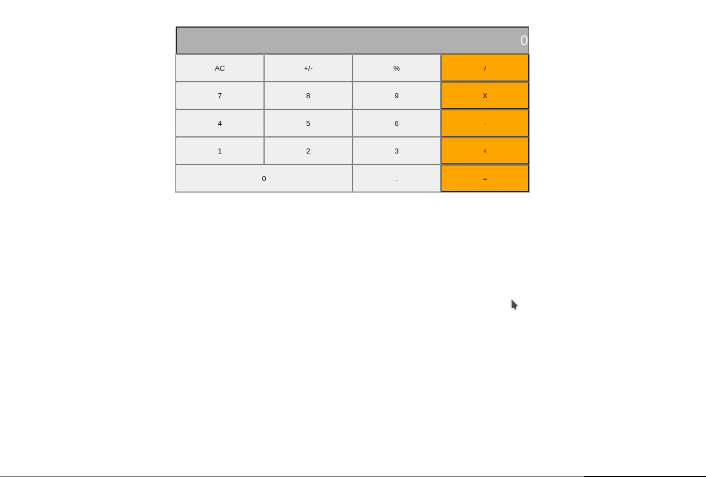

# Calculator
> 

Calculator is a web application where you can calculate any operation available.

## Live demo
[See Project](https://simongrchevski.github.io/oneCalcToComputeThemAll/)

## Built With

- Javascript
- CSS
- React

## Getting Started

**To get the local copy of the project up and running you will need to run the following commands on your terminal:**

- ``git clone git@github.com:SimonGrchevski/oneCalcToComputeThemAll.git``

And then In your terminal run : 

- `cd oneCalcToComputeThemAll`

To install all the available dependecies run:
- ``npm install``

Run the following command to build:
- ``npm run build``

To run this application locally :

- `npm start`

## Authors

👤 Simon Grchevski

- GitHub: [Github](https://github.com/SimonGrchevski)
- LinkedIn: [LinkedIn](https://www.linkedin.com/in/simon-grchevski-682935209/)
- Twitter: [Twitter](https://twitter.com/grchevski)

## 🤝 Contributing

Contributions, issues, and feature requests are welcome!

Feel free to check the [issues page](https://github.com/moise10r/Awesome_Book/issues).
